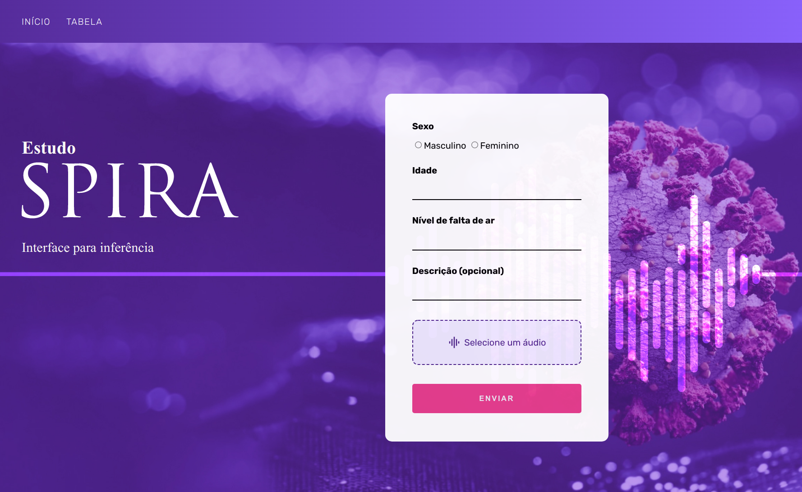

<h1 align="center">SPIRA DASHBOARD - LABXP</h1>

  

  <i>Projeto do <a href="http://ccsl.ime.usp.br/wiki/LabXP2021">LabXP</a> em parceria com o <a href="https://spira.ime.usp.br/">SPIRA.</a></i>

 

## <b>Tabela de Conteúdo</b>
---
 - [Integrantes](#integrantes)
 - [Ferramentas](#ferramentas)
 - [Desenvolvimento](#desenvolvimento)
    - [Preparação e decisões iniciais](#preparação-e-decisões-iniciais)
 - [Futuros Passos](#futuros-passos)

 

## Integrantes
---

- <b>João Vitor Soares</b>
- <b>Leonardo Meireles da Silva</b>
- <b>Lucas Vilela Aleixo</b>
- <b>Raul Mello Silva</b>
- <b>Vitor Daisuke Tamae</b> 
- <b>Ygor Sad Machado</b>

 

## Ferramentas
---

 - [TypeScript](https://www.typescriptlang.org/)
 - [Express](https://expressjs.com/pt-br/)
 - [Docker](https://www.docker.com/)
 - [MongoDB](https://www.mongodb.com/)
 - [Jestjs](https://jestjs.io/)

 

## Desenvolvimento
---

## Futuros Passos
---

- CI
- Dockerizar a aplicação
- Deploy da aplicação